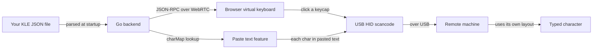
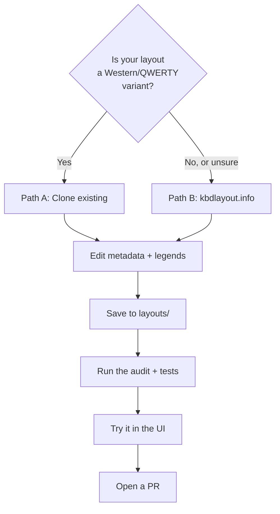
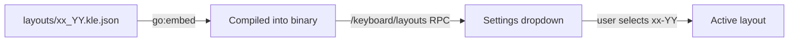
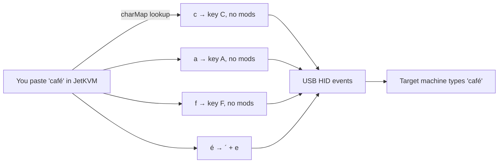

# Adding a Keyboard Layout to JetKVM — A Contributor's Walkthrough

> **You are:** Someone who knows their physical keyboard layout and wants to add support for it (or fix one that's wrong). You don't need to know Go, you don't need to know JetKVM internals, you just need to be patient and read carefully.
>
> **You will:** Add a single JSON file to `internal/keyboard/layouts/`, run the test suite, click a button in the UI, and open a pull request.
>
> **Time:** 30–60 minutes the first time, much less for subsequent layouts.

---

## Table of contents

- [What you're building](#what-youre-building)
- [The two paths](#the-two-paths)
  - [Path A — Clone an existing layout (recommended for QWERTY-family)](#path-a--clone-an-existing-layout-recommended-for-qwerty-family)
  - [Path B — Start from kbdlayout.info (recommended for unfamiliar layouts)](#path-b--start-from-kbdlayoutinfo-recommended-for-unfamiliar-layouts)
- [Editing the metadata block](#editing-the-metadata-block)
- [Editing legends — how a string becomes a keycap](#editing-legends--how-a-string-becomes-a-keycap)
- [Naming and registration](#naming-and-registration)
- [Aliases (optional)](#aliases-optional)
- [Trying it out](#trying-it-out)
- [Submitting](#submitting)
- [Troubleshooting](#troubleshooting)
- [Reference: the metadata block](#reference-the-metadata-block)

---

## What you're building

JetKVM lets you control a remote machine. When you press a key in your browser, JetKVM sends a USB **scancode** (a numeric ID for a *physical* key) to the remote machine. The remote machine then interprets that scancode according to **its own** keyboard layout.

This means: **the layout file isn't telling the remote machine which letters to type.** It's telling JetKVM:

1. What the keys *look like* on the on-screen virtual keyboard.
2. Which Unicode characters can be pasted (the **paste text** feature) — and what scancode + modifier combination produces each character on a machine running this layout.



The whole pipeline is data-driven from your one JSON file. There is no Go code to write.

---

## The two paths



Pick the path that fits. If you already know how `de_DE` or `fr_FR` works on a real keyboard, Path A is faster. If you have no idea what's where on, say, a Hungarian or Greek keyboard, Path B is much safer because you're copying from an authoritative source.

---

## Path A — Clone an existing layout (recommended for QWERTY-family)

1. Look at `internal/keyboard/layouts/`. Pick the file *closest* to your target. For a "QWERTY with one or two keys swapped" variant, `en_US.kle.json` is the natural starting point. For a typical European ISO layout, `de_DE.kle.json` (105-key ISO with dead keys) is a great template.

2. Copy the file:

   ```bash
   cp internal/keyboard/layouts/de_DE.kle.json internal/keyboard/layouts/xx_YY.kle.json
   ```

   Where `xx_YY` is your locale. **Use underscores in the filename** (more on this in [Naming and registration](#naming-and-registration)).

3. Open the file in your editor. The structure is:

   ```jsonc
   [
     { "name": "...", "author": "JetKVM", "deadKeys": [...] },   // metadata
     [ /* row 1: function keys */ ],
     [ /* row 2: number row */ ],
     [ /* row 3: QWERTY row */ ],
     [ /* row 4: ASDF row */ ],
     [ /* row 5: ZXCV row */ ],
     [ /* row 6: bottom row with Space */ ]
   ]
   ```

4. Skip ahead to [Editing the metadata block](#editing-the-metadata-block) and [Editing legends](#editing-legends--how-a-string-becomes-a-keycap).

---

## Path B — Start from kbdlayout.info (recommended for unfamiliar layouts)

[kbdlayout.info](https://kbdlayout.info/) catalogues every Windows keyboard layout. Each layout page gives you an exportable KLE JSON.

1. Find your layout. The URL pattern is `https://kbdlayout.info/<KLID>/` where `<KLID>` is an 8-character hex code Microsoft assigns. Browse [the index](https://kbdlayout.info/) or search.

2. Click **Download** (top of the page) and pick **KLE-compatible JSON**. You get a file named something like `kbdhe.kle.json`.

3. Move and rename it:

   ```bash
   mv ~/Downloads/kbdhe.kle.json internal/keyboard/layouts/el_GR.kle.json
   ```

   The locale code (`el_GR` for Greek-Greece in this example) is what matters; the original filename is forgettable.

4. Open the file. kbdlayout.info exports include a metadata block but **not** in the shape JetKVM wants. You'll fix that next.

> **Tip:** Save the kbdlayout.info URL — you'll paste it into the metadata block as `kbdLayoutInfo` so future maintainers can re-check your layout against the source.

---

## Editing the metadata block

The **first element** of the top-level array is a property object holding the metadata. Edit it to look like this:

```jsonc
[
  {
    "name":          "Ελληνικά el-GR (ISO 105)",
    "author":        "JetKVM",
    "deadKeys":      ["´", "¨", "`"],
    "kbdLayoutInfo": "https://kbdlayout.info/00000408/"
  },
  /* …rows of keys… */
]
```

| Field | What goes in it |
|---|---|
| `name` | What appears in the JetKVM settings dropdown. Convention: **native name + locale code + form factor**, e.g. `"Deutsch de-DE (ISO 105)"`, `"日本語 ja-JP (JIS 109)"`. Use the layout's native script if there is one. |
| `author` | `"JetKVM"` for built-in layouts. If you want personal credit, your name is fine too. |
| `deadKeys` | The legend characters that act as **dead keys** (no character produced until the next key — typically accents like `^`, `´`, `¨`, `~`, `` ` ``). See [the dead keys section](#dead-keys-getting-this-right-matters). |
| `kbdLayoutInfo` | URL to the kbdlayout.info page for this layout. Optional but encouraged — it lets future contributors re-audit against the canonical source. |

### Dead keys: getting this right matters

A **dead key** is one that doesn't type a character on its own. Pressing it puts the keyboard in a "waiting" state; the *next* key you press combines with the dead key to produce an accented character.

- French keyboard: pressing `^` then `a` produces `â`. The `^` key is a dead key.
- US keyboard: pressing `^` produces `^` immediately. The `^` key is **not** a dead key.

If you list a character in `deadKeys`, JetKVM:

- Renders that key with a small orange dot indicator.
- Generates composed characters in the paste-text dictionary (`â`, `é`, `ñ`, etc.) by combining the dead key with each base letter.
- Sends the dead key + Space when you paste a bare `^` (because that's how a real keyboard produces `^`).

**Get this list from the operating system, not from the keycap legends.** Some keys *look* like accents but type immediately on a given layout. The simplest check:

1. On a real machine running the target layout, press the suspected key.
2. If a character appears immediately → **not a dead key**, omit from the list.
3. If nothing appears until you press another key → **dead key**, include it.

If your layout has no dead keys at all (`en-US`, `ru-RU`, etc.), **omit the `deadKeys` field entirely.** Don't write `"deadKeys": []` — omitting it is the canonical "no dead keys" signal.

---

## Editing legends — how a string becomes a keycap

Each row of the keyboard is a JSON array. Each element of that row is either a **property object** (size, gap, color) or a **legend string**. Property objects modify the *next* key; legend strings *are* keys.

```jsonc
[
  { "w": 1.5 },     // next key is 1.5 units wide
  "Tab",            // ← a key
  "Q",              // ← a key
  "W"               // ← a key
]
```

### Layered legends — the `\n` separator

A legend string can hold up to four characters, one per modifier layer, separated by `\n`:

```text
"!\n1\n²\n¹"
   │  │  │  └─ Shift+AltGr
   │  │  └──── AltGr
   │  └─────── Normal (unmodified press)
   └────────── Shift
```

Any layer can be empty. To skip a slot, leave it blank between separators: `"!\n1"` (only Normal and Shift), `"\n\n²"` (only AltGr).

**Single-legend keys** — keys with only one label (Space, Tab, Enter, F1…) — are written as just `"Space"`, `"Tab"`, etc. The parser treats a single legend as the unmodified press automatically.

### How layers map to corners on the rendered keycap

In the on-screen virtual keyboard, the four layer slots show up in four corners of the keycap:

```
 ┌───────────────────┐
 │ Shift     ShiftAltGr│
 │                    │
 │                    │
 │ Normal       AltGr │
 └───────────────────┘
```

A real example — the Q key on `de_DE`:

| Layer | Value | Where it shows | Why |
|---|---|---|---|
| Normal | `q` | bottom-left | unmodified |
| Shift | `Q` | top-left | Shift held |
| AltGr | `@` | bottom-right | AltGr held |
| ShiftAltGr | (empty) | not shown | nothing assigned |

Encoded: `"Q\nq\n\n@"` — Shift, Normal, ShiftAltGr (empty), AltGr.

> **Heads up — letter keys auto-case for you.** If you write just `"q"`, JetKVM auto-fills Shift with `"Q"`. If you write just `"Q"`, JetKVM auto-fills Normal with `"q"` and Shift with `"Q"`. So `"q"`, `"Q"`, `"q\nQ"`, and `"Q\nq"` all render identically. Don't worry about it.

### Single-character keycaps render centred

Any key whose only legend is a single label (`"Space"`, `"F1"`, `"Caps Lock"`, the spacebar) renders with the legend centred — the four-corner layout only kicks in when there are *multiple* legends.

```
 ┌────────────────┐
 │                │
 │     Space      │   ← single legend, centred
 │                │
 └────────────────┘
```

### Special characters in legends

Some characters need to be JSON-escaped:

| Character | In a JSON string | Notes |
|---|---|---|
| `"` (double quote) | `\"` | because `"` ends the JSON string |
| `\` (backslash) | `\\` | so backslash-backslash, two characters |
| Newline (layer separator) | `\n` | the layer separator itself |
| Anything Unicode | Just paste it | UTF-8 is fine |

Example — the QWERTY backslash key on `en_US` is `"|\n\\"` (Shift = `|`, Normal = backslash). The `\\` is one backslash character escaped for JSON.

### Width, gaps, special shapes

These come from the property objects between legend strings:

| Property | Meaning | Common values |
|---|---|---|
| `"w": N` | next key is `N` units wide | `1` (default), `1.25`, `1.5`, `1.75`, `2`, `2.25`, `2.75`, `6.25` (spacebar) |
| `"x": N` | shift the next key right by `N` units (a gap) | `0.25`, `0.5`, `1` |
| `"y": N` | shift the row down by `N` units (vertical gap) | `0.5` (between F-row and number row) |
| `"h": N` | next key is `N` units tall | `2` (numpad Enter, ISO Enter "tall" part) |
| `"w2", "h2", "x2", "y2"` | second rectangle for L-shaped keys (ISO Enter) | see existing `de_DE`/`en_UK` for examples |
| `"d": true` | this is a **decal** (label printed on the case, not a physical key) | rare |
| `"n": true` | homing bump (typically F and J) | optional |
| `"a": N` | label alignment | mostly leave alone; see [KLE wiki](https://github.com/ijprest/keyboard-layout-editor/wiki/Serialized-Data-Format) |

If you started from kbdlayout.info or cloned an existing layout, all of this is already correct — you'll mostly only edit the legend strings themselves.

### Don't worry about scancodes

You almost never set scancodes manually. JetKVM **infers** the scancode for each key from its position on the board (a Q on a 105-key ISO board is always HID `0x14`, no matter the layout). If your layout uses a non-standard physical arrangement, see the [Scancode overrides section in DEVELOPMENT.md](DEVELOPMENT.md#scancode-overrides-for-non-standard-layouts), but most contributors will never touch this.

### A note for kbdlayout.info exports — `"X\nX"` shorthand

kbdlayout.info likes to write numpad keys and unmodifiable keys as `"7\n7"`, `"+\n+"`, `"Space\nSpace"` — the same legend on Shift and Normal. JetKVM **automatically collapses** these to a single legend at parse time, so you can leave them as-is *or* simplify them by hand. Both forms produce identical results.

---

## Naming and registration

### File naming

Save your file as:

```
internal/keyboard/layouts/<locale>.kle.json
```

Use **underscores** in the filename: `de_DE`, `fr_BE`, `ja_JP`, `el_GR`. The convention is `language_REGION` with the language part lowercased and the region uppercased.

### Layout ID

The layout ID is the same string with a hyphen instead of an underscore: `de-DE`, `fr-BE`, `ja-JP`, `el-GR`. This is the value that ends up in the device's saved configuration and the dropdown identifier.

You don't write the ID anywhere — it's derived from the filename automatically.

### Registration

There is none. Drop the file in `internal/keyboard/layouts/`, rebuild the binary, and the layout appears in the UI. The build system uses Go's `go:embed` to bundle every `*.kle.json` file in the directory.



---

## Aliases (optional)

Some locales have multiple commonly used codes. For example, Belgium uses both `nl-BE` (Dutch) and `fr-BE` (French) for what is functionally the same physical layout. Rather than ship two copies, JetKVM supports **aliases**.

To add an alias, edit `internal/keyboard/builtin.go` and add an entry to `layoutAliases`:

```go
var layoutAliases = map[string]string{
    "nl-BE": "fr_BE", // Belgian AZERTY — same physical layout
    "your-alias-here": "filename_stem",
}
```

The alias key is the public ID; the value is the file stem (without `.kle.json`). Use this when two locale codes deserve the same physical layout. Don't use it as a substitute for actually shipping a separate layout when keys differ.

---

## Trying it out

### 1. Validate the layout statically

```bash
go test ./internal/keyboard/...
```

The test suite parses every layout, checks key counts, ensures every legend is recognised, and exercises the dead-key composition machinery. If your file fails parsing or has unknown legends, you'll see a clear error here.

### 2. Compare against kbdlayout.info

```bash
go run ./scripts/audit_layouts.go xx_YY
```

If you set `kbdLayoutInfo` in the metadata, this downloads the reference KLE from kbdlayout.info and compares it against your local file character-by-character. Output:

- `PASS` — the layout matches the reference closely enough.
- `WARN` — there are differences. Run with `-v` for detail: `go run ./scripts/audit_layouts.go -v xx_YY`. The script labels expected differences (ISO/ANSI key remaps, dead-key indirection) as `[allow]`. Anything labelled `[warn]` or `[FAIL]` deserves your attention.

### 3. Try it in the actual UI

Build and deploy the binary to your dev device:

```bash
./dev_deploy.sh -r <DEVICE_IP>
```

Open the JetKVM web UI, go to **Settings → Keyboard**, and pick your new layout from the dropdown. You should see:

- The on-screen virtual keyboard renders with your legends.
- Keys you marked as dead keys show a small orange dot.
- Holding Shift on the virtual keyboard or your physical keyboard flips legends to the Shift layer.
- Holding AltGr (Right Alt) flips legends to the AltGr layer.

### 4. Test paste

Connect the JetKVM to a target machine that's set to your layout. Open a text editor on that machine. In JetKVM, click **Paste Text**, type in some characters that include accents, dead-key compositions, and AltGr-layer characters, and confirm.

The target should receive exactly the text you pasted. If it gets garbled or a character disappears, your `deadKeys` list or one of the legends is probably off.



---

## Submitting

1. Run `go test ./internal/keyboard/...` once more.
2. Commit your single new file (and the `builtin.go` edit if you added an alias).
3. Open a pull request against `dev`. The PR description should cover:
   - Which layout you're adding (locale code + native name).
   - Which kbdlayout.info page or other source you used.
   - Whether you have access to a real machine running this layout to validate paste round-trips.
4. The maintainers will run the audit script and may ask for tweaks if the comparison flags something unexpected.

---

## Troubleshooting

| Symptom | What it usually means |
|---|---|
| `go test` fails with *"layout only has N keys — does not look like a full keyboard"* | A row is malformed, or you accidentally deleted too many keys. Open the file in [keyboard-layout-editor.com](https://www.keyboard-layout-editor.com) (Raw Data tab) to visualise it. |
| `go test` fails with *"only N% of keys mapped to HID scancodes"* | Your layout's physical arrangement doesn't match a standard 100/105/109-key board. Either re-arrange the rows to match a standard board, or use the `scancodes` metadata override (see DEVELOPMENT.md). |
| Audit reports *"charMap missing 'X'"* | A character that the reference layout produces is unreachable in your charMap. Usually a missing legend on the right key. |
| Audit reports *"legend differs"* on a specific scancode | One of your legend strings differs from the reference. Verify the legend on the relevant key. |
| The keycap shows the legend in the wrong corner | You put the character in the wrong layer slot. See [How layers map to corners](#how-layers-map-to-corners-on-the-rendered-keycap). |
| Pasted text comes out wrong on the target | Either your `deadKeys` list is wrong, or a layered character is in the wrong slot. Run the audit with `-v` to compare against the reference. |

---

## Reference: the metadata block

Full schema of the optional metadata object (first element of the top-level array):

```jsonc
{
  // Standard KLE fields (rendered by keyboard-layout-editor.com but not by JetKVM):
  "name":      "Display name",
  "author":    "Attribution",
  "notes":     "Free-form notes",
  "backcolor": "#background",
  "radii":     "key corner radii spec",

  // JetKVM extensions:
  "deadKeys":      ["^", "´"],          // optional; omit if no dead keys
  "scancodes":     { "42": 76 },        // optional; per-key HID overrides
  "kbdLayoutInfo": "https://kbdlayout.info/<KLID>/"  // optional; for the audit script
}
```

See [TRANSPORT.md](TRANSPORT.md) for the rest of the wire format if you're curious about what JetKVM does with the parsed result.

---

## Final note

Most layouts in `internal/keyboard/layouts/` were added by contributors who did exactly the steps above. Read a few of them before you start — `de_DE.kle.json` is small and well-shaped, `ja_JP.kle.json` shows the kana layers, `cs_CZ.kle.json` has the busiest dead-key set. Pattern-matching against existing files is the fastest way to a good PR.

Welcome aboard.
