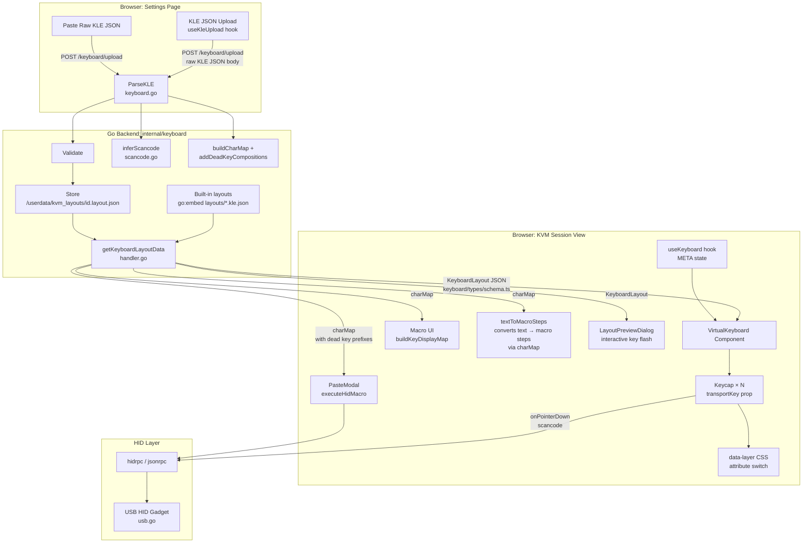
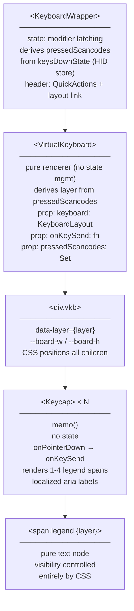

# JetKVM Virtual Keyboard — Design Document

> **Purpose:** Design and implementation record for the KLE-based virtual keyboard system in the JetKVM React frontend.
>
> **Context:** This work emerged from a code review of [jetkvm/kvm](https://github.com/jetkvm/kvm). The full conversation history is summarised in the [Background](#background) section.

---

## Table of Contents

- [JetKVM Virtual Keyboard — Design Document](#jetkvm-virtual-keyboard--design-document)
  - [Table of Contents](#table-of-contents)
  - [Background](#background)
  - [Problem Statement](#problem-statement)
  - [Architecture Overview](#architecture-overview)
  - [Physical Keyboard: Why `event.code` Is Correct](#physical-keyboard-why-eventcode-is-correct)
    - [How it works](#how-it-works)
    - [Why `event.key` was considered and rejected](#why-eventkey-was-considered-and-rejected)
    - [When layouts mismatch](#when-layouts-mismatch)
  - [KLE Format Primer](#kle-format-primer)
    - [Top-Level Structure](#top-level-structure)
    - [Key Legend Encoding](#key-legend-encoding)
    - [Key Property Objects](#key-property-objects)
    - [What KLE Does NOT Contain (and JetKVM Extensions)](#what-kle-does-not-contain-and-jetkvm-extensions)
  - [Data Flow](#data-flow)
    - [HID Scancode Inference](#hid-scancode-inference)
    - [Dead Key Compositions](#dead-key-compositions)
    - [Scancode Overrides via KLE Metadata](#scancode-overrides-via-kle-metadata)
    - [Compact Form Factor Support](#compact-form-factor-support)
    - [Auto-Uppercase Legends](#auto-uppercase-legends)
  - [Component Tree](#component-tree)
  - [CSS-First Rendering Strategy](#css-first-rendering-strategy)
    - [Layer Switching](#layer-switching)
    - [All-Layers Preview Mode](#all-layers-preview-mode)
    - [Key Sizing](#key-sizing)
    - [LED Indicators](#led-indicators)
  - [Built-in Layouts](#built-in-layouts)
  - [File Reference](#file-reference)
    - [Design note: why Go parses, not the client](#design-note-why-go-parses-not-the-client)
  - [References](#references)
  - [Open Issues Addressed](#open-issues-addressed)
  - [UI Languages Without a Dedicated Keyboard Layout](#ui-languages-without-a-dedicated-keyboard-layout)
  - [What Is Not In Scope](#what-is-not-in-scope)

---

## Background

JetKVM is a KVM-over-IP device: it sits between a controller (the person)
and a target machine (the server/PC being managed), forwarding keyboard,
video, and mouse over WebRTC. The frontend is a React + TypeScript app
served from the device itself.

The keyboard system has been a persistent source of bugs and user frustration. As of the time of this design:

- The virtual keyboard is English-only (`react-simple-keyboard`, hardcoded QWERTY)
- The "Paste Text" feature only has US scancode tables, so pasting to a German/French/etc. target produces garbled output
- Users with non-US *operator* keyboards (AZERTY, Dvorak) perceive wrong characters when their layout differs from the target's — this is actually correct KVM behaviour (physical position passthrough), but the virtual keyboard and paste system can now provide character-accurate input for these cases
- There is no clear contribution path for new layouts (see GitHub issues #1184, #1067, #65, #30, #649, #223) — now addressed with KLE upload, built-in layouts, a validate script, and a GitHub issue template

---

## Problem Statement

The key concept is the **target layout** — the keyboard layout configured on
the *controlled machine*. The physical keyboard passthrough uses HID scancodes
(position-based, like a USB cable), which is correct KVM behaviour. But the
virtual keyboard, paste text, and macro display all need to know the target
layout to show correct legends and send correct character sequences.

The virtual on-screen keyboard needs to:

- Accurately represent the **target** layout (correct key shapes, legends in all layers)
- Be driven by a standard, community-familiar format
- Switch between Shift/AltGr layers with **zero JavaScript rerender** (pure CSS)

---

## Architecture Overview



---

## Physical Keyboard: Why `event.code` Is Correct

The physical keyboard handler in `WebRTCVideo.tsx` uses `event.code` (physical
key position) to derive HID scancodes. This is the **correct behaviour** for a
KVM device — it matches how a physical USB cable or hardware KVM switch works.

### How it works

1. Operator presses a key → browser reports `event.code` (physical position)
2. We map `event.code` → HID Usage ID (the same scancode the physical key
   would produce over USB)
3. Target OS receives the scancode and interprets it based on **its own**
   configured keyboard layout

This is transparent physical position passthrough — exactly what hardware does.

### Why `event.key` was considered and rejected

A proposal for using `event.key` (the logical character the operator's OS resolved)
to look up the target scancode via `charMap`. This would "translate" between
mismatched operator/target layouts.

This was rejected because:

| Concern | Detail |
|---|---|
| **Dead keys** | `event.key` is `"Dead"` for dead key presses — we lose which dead key was pressed |
| **IME input** | `event.key` is `"Process"` during CJK composition — breaks Japanese/Chinese/Korean input |
| **Modifier combos** | `event.key` for Ctrl+C can be `"\x03"` or `"c"` depending on browser |
| **Existing workarounds** | The AltGr Windows fix, Meta key workaround, and IME fix in `WebRTCVideo.tsx` all rely on `event.code` semantics |
| **KVM expectations** | Power users expect a KVM to behave like a USB cable. Character translation would be surprising and hard to debug |

### When layouts mismatch

If the operator has a French AZERTY keyboard but the target is configured for
German QWERTZ, physical position passthrough means the operator must "think in
the target layout" — the same experience as plugging a French keyboard directly
into the German machine via USB. This is a fundamental property of KVM devices.

The virtual keyboard and paste text system **do** use the target layout's
charMap for character-accurate input — these are the correct tools for when
the operator needs to type characters that don't exist on their physical
keyboard or when layouts differ.

---

## KLE Format Primer

[keyboard-layout-editor.com](https://www.keyboard-layout-editor.com) exports a JSON format that is the de-facto standard for describing physical keyboard layouts. It is widely used in the custom keyboard community, meaning thousands of layouts already exist.

### Top-Level Structure

```json
[
  { "name": "German QWERTZ", "author": "example" },
  ["^", "1\n!\n²\n¹", "2\n\"\n³", "3\n§\n³", ...],
  [{"w":1.5}, "Tab", "q\nQ", "w\nW", ...]
]
```

- First element (optional): metadata object
- Remaining elements: arrays representing keyboard rows
- Each row contains strings (key legends) and objects (property modifiers for subsequent keys)

### Key Legend Encoding

Legends are newline-separated strings. Position order (when `a=4`, the default):

```
position 0 = unshifted (bottom-left by KLE convention, but semantically: normal)
position 1 = shifted    (top-left)
position 2 = AltGr      (bottom-right)  
position 3 = Shift+AltGr (top-right)
```

So `"1\n!\n²\n¹"` means:
- Normal: `1`
- Shift: `!`
- AltGr: `²`
- Shift+AltGr: `¹`

### Key Property Objects

Property objects appear before the keys they modify:

```json
{"w": 1.5}            // next key is 1.5 units wide
{"x": 0.5}            // add 0.5u gap before next key  
{"w": 1.25, "h": 2, "w2": 1.5, "h2": 1, "x2": -0.25}  // ISO Enter
{"c": "#ff0000"}      // all subsequent keys are red (KLE colorway)
```

Properties `w`, `h`, `x`, `y`, `w2`, `h2`, `x2`, `y2`, `l` (stepped), `n` (homing), `d` (decal) apply to the **next key only**.

Properties `c` (color), `t` (text color), `a` (alignment), `f` (font size) apply to **all subsequent keys**.

### What KLE Does NOT Contain (and JetKVM Extensions)

Standard KLE has no concept of:

- **HID scancodes** — inferred from physical position by `inferScancode()` in `scancode.go`. Can be overridden per-key via the `scancodes` metadata extension.
- **Dead key declarations** — the `deadKeys` metadata extension declares which legend characters are dead keys. This gates both the CSS dead key indicator AND charMap composition generation. Dead key composition rules are derived from Unicode NFC normalization by `addDeadKeyCompositions()` in `keyboard.go`. Layouts without `deadKeys` produce no compositions.

JetKVM extends the KLE metadata object with two optional fields:

| Field | Type | Purpose |
|---|---|---|
| `deadKeys` | `string[]` | Legend characters that are dead keys (drives CSS `.dead` class AND charMap composition generation) |
| `scancodes` | `Record<string, number>` | Key index to HID Usage ID overrides |

---

## Data Flow

```mermaid
flowchart LR
    subgraph "Input: KLE JSON"
        KLEFILE[user-uploaded\nor built-in .kle.json]
    end

    subgraph "parseKLE()"
        KLEFILE --> META2[Extract metadata]
        KLEFILE --> ROWS[Parse rows\naccumulate x/y]
        ROWS --> PROPS[Apply property\nobjects]
        PROPS --> LEGENDS[Split legend string\nauto-uppercase letters]
        LEGENDS --> SHAPE[Detect shape\niso-enter / stepped]
        SHAPE --> SCANCODE[Infer HID scancode\nfrom x/y position]
    end

    subgraph "KeyboardLayout"
        SCANCODE --> PKB[keys: TransportKey[]\nboardW, boardH]
    end

    subgraph "Derived maps"
        PKB --> CHARMAP[buildCharMap:\nnormal → scancode+0\nshift  → scancode+SHIFT\naltgr  → scancode+ALTGR]
        CHARMAP --> DEADKEYS[addDeadKeyCompositions:\nUnicode NFC normalization\ndead key + base → composed]
    end

    subgraph "Usage"
        PKB --> VKBRENDER[VirtualKeyboard\nrender]
        DEADKEYS --> PASTETXT[PasteModal\nchar→HID lookup\nwith dead key prefixes]
        DEADKEYS --> MACRODISPLAY[Macro UI\nbuildKeyDisplayMap]
    end
```

### HID Scancode Inference

Since KLE doesn't carry scancodes, we infer from physical position. The standard key grid is well-defined:

```
Row 0: Escape, F1-F12                    (y=0)
Row 1: `, 1-9, 0, -, =, Backspace        (y=1, x=0..14)
Row 2: Tab, Q-P, [, ], \                 (y=2, x=0..13.5)
Row 3: CapsLock, A-L, ;, ', Enter        (y=3, x=0..13.75)
Row 4: LShift, Z-M, ,, ., /, RShift      (y=4)
Row 5: LCtrl, Meta, LAlt, Space, RAlt... (y=5)
```

The position-to-scancode table is in `internal/keyboard/scancode.go`. It covers
ANSI, ISO, and basic numpad/nav cluster positions. JIS-specific keys (Yen,
Ro, Muhenkan, Henkan, Kana) are handled by position as well.

### Dead Key Compositions

Dead keys (^, `, ´, ¨, ~, ¸, ˛, ˙, ˚, ˝, ˇ, ˘) don't produce a character
immediately — they modify the next keypress. There are two related but
independent mechanisms:

**1. Dead key CSS flag (metadata-driven)**

The `deadKeys` array in the KLE metadata declares which legend characters are
dead keys for this layout. Example from `de-DE`:

```json
{ "name": "Deutsch de-DE (ISO 105)", "deadKeys": ["^", "´", "`"] }
```

Only keys whose **normal** legend matches a declared dead key character get
the `dead: true` flag on their `TransportKey`, which the frontend renders
with the `.dead` CSS class (visual indicator dot). If the metadata has no
`deadKeys` array (e.g. `en-US`), no keys are flagged.

**2. Dead key compositions in charMap (metadata-gated, Unicode NFC)**

`addDeadKeyCompositions()` generates composed character entries for the
paste/macro system, but **only for layouts that declare dead keys** in their
`deadKeys` metadata. This is critical: on a US keyboard `^` is just Shift+6
and produces the character directly — sending it as a dead key prefix during
paste would produce `^a` instead of `â` on the target machine.

The process for layouts that do declare dead keys:

1. `deadKeyToCombining` maps each dead key character to its Unicode combining
   form (e.g. `^` → U+0302 COMBINING CIRCUMFLEX ACCENT)
2. `addDeadKeyCompositions()` collects only key legends that appear in both
   `declaredDeadKeys` and `deadKeyToCombining`
3. For each dead key × base character pair, `norm.NFC` checks for composed forms
4. Composed characters get a `HIDCombo` with a `Prefix` field — e.g.
   `"â"` → `{s: 4, m: 0, p: {s: 47, m: 0}}` (press `^` dead key, then `a`)
5. Standalone dead key characters get `Prefix` + Space follow-up (e.g.
   pressing `^` then Space produces the `^` character itself)

Layouts without `deadKeys` metadata (e.g. `en-US`, `ru-RU`) produce zero
prefixed charMap entries — characters like `^`, `~`, `` ` `` are treated as
normal keys that output directly.

The frontend PasteModal checks `combo.p` and sends the prefix keystroke
first when present.

### Scancode Overrides via KLE Metadata

Position-based scancode inference works well for standard ANSI, ISO, and JIS
layouts, but non-standard form factors (split, ortholinear, custom) may have
keys in positions that don't match any table entry.

The `scancodes` field in KLE metadata maps a **key index** (0-based, in parse
order) to a USB HID Usage ID, overriding whatever `inferScancode()` would
have returned:

```json
{
  "name": "My Custom Layout",
  "scancodes": { "42": 76, "55": 83 }
}
```

In this example, key #42 is forced to scancode 76 (0x4C = Delete) and key #55
to scancode 83 (0x53 = NumLock). The override is applied immediately after
legend parsing and before compact-layout re-inference, so metadata overrides
are never clobbered by the compact table pass.

This is primarily useful for:

- Community-uploaded layouts with unusual physical arrangements
- Keys that fall outside the standard ANSI/ISO grid
- Compact layouts where the automatic `compactTable` gets a few edge-case
  keys wrong

### Compact Form Factor Support

The scancode inference engine supports compact keyboards (60%, 65%, 75%, TKL)
in addition to full-size layouts.

`selectPositionTable()` in `scancode.go` selects the appropriate position
table based on board dimensions and key count:

- **Full-size** (`boardW > 20` or `keyCount >= 100`): uses `fullSizeTable`,
  which expects the standard y:0.5 gap between the function row and the
  number row, plus numpad and navigation clusters.
- **Compact** (everything else): uses `compactTable`, which handles layouts
  without the y:0.5 gap. Rows are at integer Y positions (0, 1, 2, 3, 4, 5).
  The compact table covers 60%, 65%, 75%, and TKL form factors with nav keys
  on the right side of typing rows.

After the initial full-size inference pass during parsing, the parser detects
compact layouts (`boardW <= 20 && keyCount < 100`) and re-infers scancodes
using the compact table. Keys that already have a scancode override from
metadata are skipped during re-inference.

For edge cases where even the compact table produces incorrect mappings,
the `scancodes` metadata field can provide per-key overrides (see above).

### Auto-Uppercase Legends

The Go parser auto-generates shift legends for single-character keys.
If a KLE legend is just `"q"` (no explicit shift layer), the parser
produces `normal: "q", shift: "Q"` automatically. This works for Latin,
accented (ö → Ö), and Cyrillic (й → Й) characters. Multi-character
legends like `"Tab"` or `"Enter"` are not affected.

---

## Component Tree



**Key design rules:**

- **Single source of truth:** `keysDownState` from the HID store drives all visual state. The wrapper decodes both `keys[]` (non-modifier scancodes) and `modifier` byte (via `hidKeyToModifierMask` reverse lookup) into a single `pressedScancodes` set.
- **Modifier latching:** Virtual keyboard modifier clicks toggle on/off (press once to hold, press again to release). Gated by `MODIFIER_LATCH_ENABLED` constant, ready to become a user setting. Latch intent is tracked in a ref; visual state comes from `keysDownState`.
- **Layer derivation:** `VirtualKeyboard` derives the display layer purely from `pressedScancodes`. Default is `'all'` (quadrant preview). When Shift/AltGr scancodes are present, switches to single-layer view.
- **Pure renderer:** `VirtualKeyboard` has no effects, no refs, no event listeners — it's a pure function of its props.
- `QuickActions` lives in the `KeyboardWrapper` header, not inside `VirtualKeyboard`
- `Keycap` is `memo()`'d — layer changes do NOT trigger keycap rerenders
- All legend show/hide logic is **CSS only** via `data-layer` attribute
- `onPointerDown` (not `onClick`) prevents focus steal from video feed
- Aria labels map key symbols (both symbol-only `⇧` and compound `⇧ Shift`) to localized names via `KEY_ARIA_NAMES` in `Keycap.tsx`

---

## CSS-First Rendering Strategy

The entire layer-switching mechanism is a single attribute change on `.vkb`. No JavaScript computes which legend is visible.

### Layer Switching

```css
/* Hide all legends by default */
.vkb .legend { display: none; }

/* Show only the active layer */
.vkb[data-layer="normal"]      .legend.normal      { display: flex; inset: 0; align-items: center; justify-content: center; }
.vkb[data-layer="shift"]       .legend.shift        { display: flex; inset: 0; align-items: center; justify-content: center; }
.vkb[data-layer="altgr"]       .legend.altgr        { display: flex; inset: 0; align-items: center; justify-content: center; }
.vkb[data-layer="shift-altgr"] .legend.shift-altgr  { display: flex; inset: 0; align-items: center; justify-content: center; }

/* Fallback: if no legend for this layer, show normal at 50% opacity */
.vkb[data-layer="shift"]       .key:not(:has(.legend.shift))       .legend.normal { display: flex; opacity: 0.5; }
.vkb[data-layer="altgr"]       .key:not(:has(.legend.altgr))       .legend.normal { display: flex; opacity: 0.5; }
```

### All-Layers Preview Mode

```css
/* Quadrant layout when data-layer="all" */
.vkb[data-layer="all"] .legend            { display: flex; font-size: 0.6rem; }
.vkb[data-layer="all"] .legend.normal     { bottom: 3px; left:  4px; }
.vkb[data-layer="all"] .legend.shift      { top:    3px; left:  4px; }
.vkb[data-layer="all"] .legend.altgr      { bottom: 3px; right: 4px; }
.vkb[data-layer="all"] .legend.shift-altgr{ top:    3px; right: 4px; }
```

### Key Sizing

Uses CSS custom properties set inline per-key from KLE data:

```css
.vkb {
  --u: 3.5rem;   /* 1 keyboard unit — change to scale entire board */
  --gap: 0.2rem;
}

.key {
  position: absolute;
  left:   calc(var(--kx) * (var(--u) + var(--gap)));
  top:    calc(var(--ky) * (var(--u) + var(--gap)));
  width:  calc(1 * var(--u));          /* overridden by .w-NNN classes */
  height: calc(var(--kh, 1) * var(--u));
}
```

Width classes (e.g. `.w-150` for 1.5u) are generated from a lookup table in `Keycap.tsx`.

### LED Indicators

Lock key LED indicators (Caps Lock, Scroll Lock, Num Lock) are driven by
CSS classes on the `.vkb` container: `.caps-lock-on`, `.scroll-lock-on`,
`.num-lock-on`. When active, a green dot (`::before` pseudo-element) appears
in the top-right corner of the corresponding keycap, matched by
`data-scancode` attribute (57, 71, 83 respectively). The `vkbClassName` prop
on `VirtualKeyboard` is the injection point for these classes.

---

## Built-in Layouts

19 KLE JSON files are embedded in the binary via `go:embed` in `builtin.go`.
Layout IDs use hyphens (e.g. `en-US`, `de-DE`) to match existing device
config values. The file lookup converts hyphens to underscores for the
filename (e.g. `en-US` → `layouts/en_US.kle.json`).

| ID | Type | Keys | Description |
|---|---|---|---|
| `en-US` | ANSI 104 | 104 | English (US) QWERTY |
| `en-UK` | ISO 105 | 105 | English (UK) |
| `cs-CZ` | ISO 105 | 105 | Czech QWERTZ |
| `da-DK` | ISO 105 | 105 | Danish |
| `de-CH` | ISO 105 | 105 | Swiss German QWERTZ |
| `de-DE` | ISO 105 | 105 | German QWERTZ |
| `es-ES` | ISO 105 | 105 | Spanish |
| `fr-BE` | ISO 105 | 105 | Belgian AZERTY |
| `fr-CH` | ISO 105 | 105 | Swiss French QWERTZ |
| `fr-FR` | ISO 105 | 105 | French AZERTY |
| `hu-HU` | ISO 105 | 105 | Hungarian QWERTZ |
| `it-IT` | ISO 105 | 105 | Italian |
| `ja-JP` | JIS 109 | 109 | Japanese |
| `nb-NO` | ISO 105 | 105 | Norwegian Bokmål |
| `nl-BE` | alias | — | Alias → `fr-BE` (Belgian AZERTY) |
| `pl-PL` | ISO 105 | 105 | Polish Programmers |
| `pt-PT` | ISO 105 | 105 | Portuguese |
| `ru-RU` | ISO 105 | 105 | Russian ЙЦУКЕН |
| `sl-SI` | ISO 105 | 105 | Slovenian QWERTZ |
| `sv-SE` | ISO 105 | 105 | Swedish |

Each built-in layout that has dead keys includes an audited `deadKeys` array
in its KLE metadata. For example, de-DE declares ``["^", "´", "`"]`` and
fr-FR declares ``["^", "¨"]``. Layouts without dead keys (e.g. `en-US`,
`ru-RU`) omit the field entirely — this is load-bearing, not just cosmetic,
because the `deadKeys` declaration gates charMap composition generation.
Omitting it ensures paste treats `^`, `~`, etc. as direct-output keys.

Special key legends use Unicode symbols: `⌫` (Backspace), `⏎` (Enter),
`⇥` (Tab), `⇪` (Caps Lock), `↑↓←→` (arrows).
Modifiers show: `⇧ Shift`, `⌃ Ctrl`, `⌥ Alt`, `⌘ Meta`, `☰ Menu`.
Numpad keys show plain characters (`1`, `+`, `/`) without a `KP` prefix.
Each layout has a locale ID decal (e.g. `en-US`) rendered as a non-interactive
label above the numpad area.

---

## File Reference

```text
├── docs/keyboard/
│   ├── DESIGN.md                ← this file
│   ├── TRANSPORT.md             ← wire contract documentation
│   └── DEVELOPMENT.md           ← contributor guide (adding layouts, dead keys, overrides)
```

```text
├── ui/src/
│   ├── components/keyboard/          ← pure rendering (no state management)
│   │   ├── types/
│   │   │   └── schema.ts             ← all TypeScript types (transport + KeyLayer)
│   │   ├── VirtualKeyboard.tsx        ← pure renderer, derives layer from pressedScancodes
│   │   ├── Keycap.tsx                 ← memo'd keycap with localized aria labels
│   │   ├── LayoutPreviewDialog.tsx    ← layout preview modal with interactive key flash
│   │   ├── useKleUpload.ts            ← file upload hook (POSTs to Go)
│   │   └── virtual-keyboard.css       ← all keyboard CSS (scoped under .vkb)
│   ├── components/
│   │   ├── VirtualKeyboard.tsx        ← KeyboardWrapper (state, latching, HID bridge)
│   │   ├── QuickActions.tsx           ← common key combo dropdown (Ctrl+Alt+Del, etc.)
│   │   ├── textToMacroSteps.ts        ← converts text strings to macro steps via charMap
│   │   ├── MacroForm.tsx              ← macro editor with text-to-macro and keyboard picker
│   │   └── MacroStepCard.tsx          ← individual macro step editor
│   └── components/popovers/
│       └── PasteModal.tsx             ← paste text using charMap + executeHidMacro
│   └── keyDisplayNames.ts             ← buildKeyDisplayMap() + modifierDisplayMap for macro UI
```

```text
├── internal/keyboard/
│   ├── keyboard.go               ← ParseKLE(), types, charMap, dead key compositions
│   ├── scancode.go               ← x/y position → HID Usage ID table
│   ├── handler.go                ← HTTP upload + JSON-RPC handlers + builtinLayouts
│   ├── builtin.go                ← go:embed for layouts/*.kle.json + alias handling
│   ├── keyboard_test.go          ← table-driven tests + builtin layout validation
│   └── layouts/                  ← 19 KLE JSON files (ANSI/ISO/JIS)
```

### Design note: why Go parses, not the client

KLE parsing, scancode inference, charMap building, and dead key composition
all happen on the Go backend (`internal/keyboard/`). The React client receives
the fully processed `KeyboardLayout` and acts purely as a renderer. There is
no client-side KLE parser, position-to-scancode table, or charMap builder.

---

## References

- [KLE format reference](https://github.com/ijprest/keyboard-layout-editor/wiki/Serialized-Data-Format)
- [HID Usage Table: USB HID Usage Tables 1.3, Keyboard/Keypad Page (0x07) for scancode reference](https://usb.org/sites/default/files/hut1_3_0.pdf)

---

## Open Issues Addressed

| GitHub Issue | Problem | Fix |
|---|---|---|
| #65 | Wrong chars from virtual keyboard on German target | Target layout KLE → correct scancode table |
| #47 | Layout mismatch guest/host | Virtual keyboard + paste use target charMap; physical keyboard uses position passthrough (same as hardware KVM) |
| #30 | AltGr combinations broken | Virtual keyboard has full AltGr layer support; physical keyboard passes AltGr position correctly |
| #223 | Virtual keyboard English only | KLE-driven renderer with layer switching for all 19 built-in layouts |
| #649 | Dvorak operator layout | Physical passthrough is correct KVM behaviour; virtual keyboard + paste provide character-accurate input |
| #1067 | Belgian FR layout missing | Built-in `fr-BE` layout + `nl-BE` alias |
| #1184 | Hungarian layout — contributor has code but can't submit | KLE upload path + built-in `hu-HU` + GitHub issue template |

---

## UI Languages Without a Dedicated Keyboard Layout

Some UI localization languages do not have a separate built-in keyboard layout
because their input method does not require one:

| UI language | Recommended layout | Reason |
|---|---|---|
| zh (Chinese Simplified) | `en-US` | Chinese input uses an OS-level IME on a standard QWERTY keyboard |
| zh-tw (Chinese Traditional) | `en-US` | Traditional Chinese uses IME (Zhuyin/Bopomofo is an IME overlay, not a physical layout) |
| cy (Welsh) | `en-UK` | Welsh uses the standard UK physical keyboard |

These users should select the recommended layout in the keyboard settings.
No KLE file is needed — the physical keys are identical to the recommended layout.

---

## What Is Not In Scope

- **Mac boot picker fix (#1070)** — requires USB HID descriptor change in `usb.go`, not a layout issue
- **Client-native copy-paste (#735)** — requires OS-level clipboard API permissions on the target, a separate workstream
